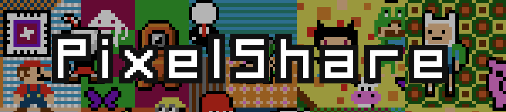

# [PixelShare API](https://github.com/PixelShareInc/API "PixelShare API")

[](https://travis-ci.org/derekkramer/pixelshare)
[]()
[](https://codeclimate.com/github/derekkramer/pixelshareAPI/maintainability)
[](https://codeclimate.com/github/derekkramer/pixelshareAPI)
[](https://david-dm.org/PixelShareInc/API)
[](https://app.fossa.io/projects/git%2Bgithub.com%2Fderekkramer%2FpixelshareAPI?ref=badge_shield)

---

**PixelShare** is a simple and easy-to-use amalgamated art project inspired by [Jordan Fred](https://github.com/JCFred). Users can access the quilt without login and can add their own pixel art to it. The API uses a [NodeJS](https://nodejs.org) back end with [Express](https://expressjs.com) and [MongoDB](https://mongodb.com).  

## Table of contents

- [Installation for Development](#Installation)
- [Community Resources](#Resources)
- [License](#License)

## <a name="Installation"><a>Installation for Development

First ensure that you have Node and Git installed by entering:

```
$ brew update
$ brew install node
$ brew install git
```

Ensure that you have MongoDB installed:

```
$ mongod --version
```

If you don't have MongoDB installed, either follow the [instructions](https://docs.mongodb.com/manual/tutorial/install-mongodb-on-os-x/) on their website, or install using brew with [Treehouse](https://treehouse.github.io/installation-guides/mac/mongo-mac.html).

Once you've installed MongoDB, in a separate terminal window, start the service:

```
$ mongod
```

Then, in your original terminal window, navigate into the directory where you want to clone the repository and enter:

```
$ git clone https://www.github.com/derekkramer/pixelshareAPI.git
```

Navigate into the repository directory and install dependencies:

```
$ npm install
```

Then create the `pixelshare` database, collections, and documents:

```
$ node db/migrate.js
$ node db/seed.js
```

Finally start the API server by running:

```
$ npm start
```

As it says in the terminal, the PixelShare development API is now available at `localhost:3001`

## <a name="Resources"><a>Community Resources


##### &emsp;&emsp;&emsp;&emsp;&emsp; [](https://nodejs.org)
##### &emsp;&emsp;&emsp;&emsp;&emsp; [](https://expressjs.com)
##### &emsp;&emsp;&emsp;&emsp;&emsp; [](http://www.socket.io)
##### &emsp;&emsp;&emsp;&emsp;&emsp; [](https://mongodb.com)

## <a name="License"><a>License

The MIT License (MIT)

Copyright &copy; 2018 Derek Kramer

Permission is hereby granted, free of charge, to any person obtaining a copy of this software and associated documentation files (the "Software"), to deal in the Software without restriction, including without limitation the rights to use, copy, modify, merge, publish, distribute, sublicense, and/or sell copies of the Software, and to permit persons to whom the Software is furnished to do so, subject to the following conditions:

The above copyright notice and this permission notice shall be included in all copies or substantial portions of the Software.

THE SOFTWARE IS PROVIDED "AS IS", WITHOUT WARRANTY OF ANY KIND, EXPRESS OR IMPLIED, INCLUDING BUT NOT LIMITED TO THE WARRANTIES OF MERCHANTABILITY, FITNESS FOR A PARTICULAR PURPOSE AND NONINFRINGEMENT. IN NO EVENT SHALL THE AUTHORS OR COPYRIGHT HOLDERS BE LIABLE FOR ANY CLAIM, DAMAGES OR OTHER LIABILITY, WHETHER IN AN ACTION OF CONTRACT, TORT OR OTHERWISE, ARISING FROM, OUT OF OR IN CONNECTION WITH THE SOFTWARE OR THE USE OR OTHER DEALINGS IN THE SOFTWARE.
